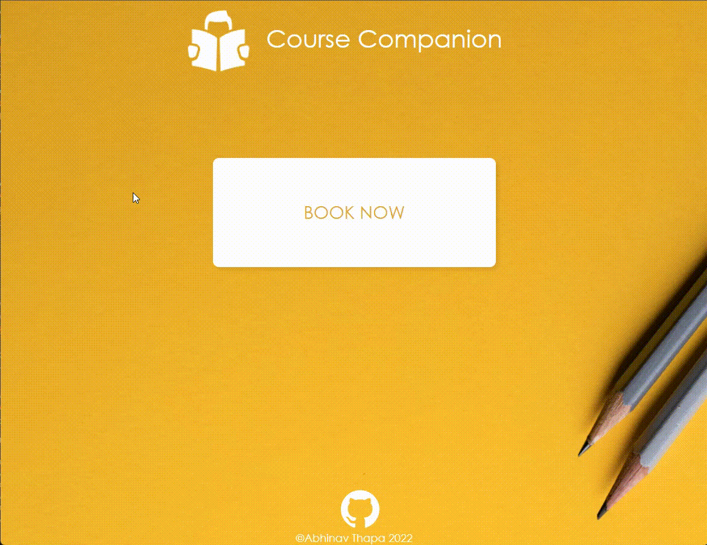
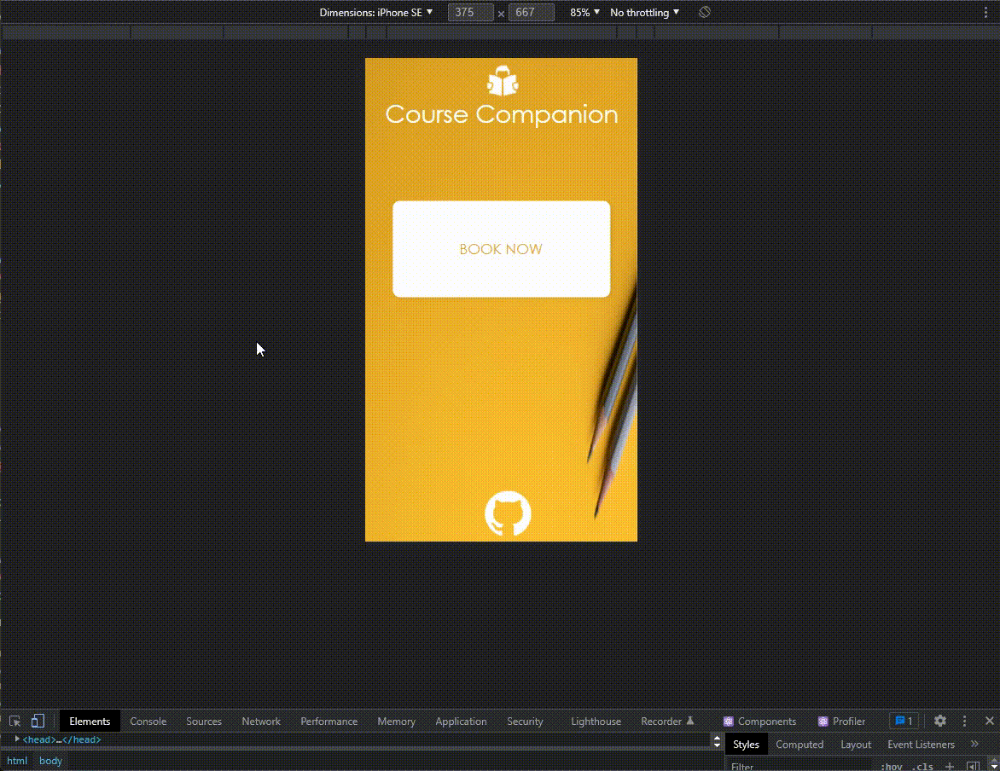
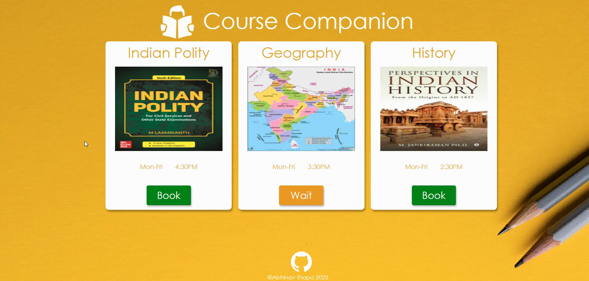
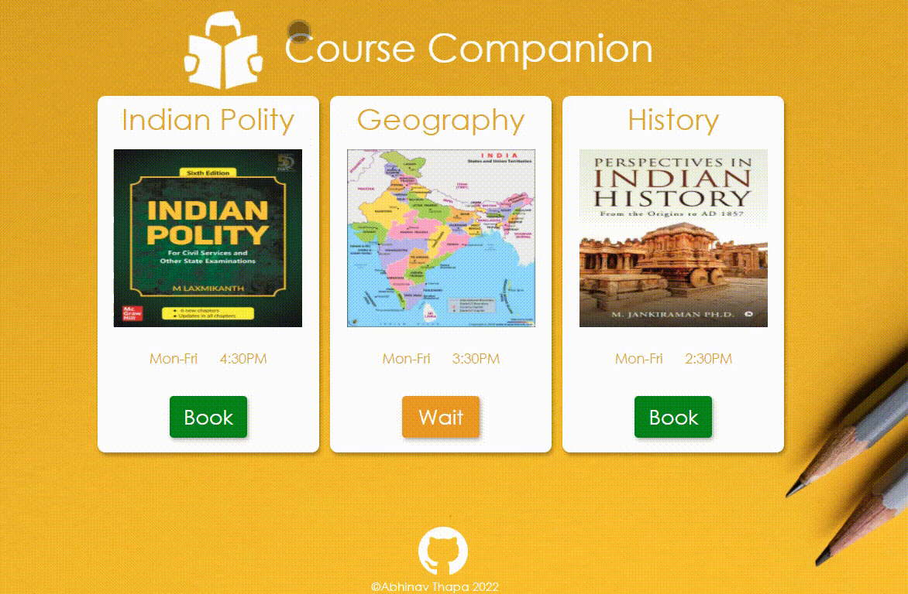

# Course-Companion (In Progress) - Copyright Abhinav Thapa 2022

### Aim of the project is to allow users to `log-in` and `book courses` of their choice. If the course is already booked, you will be added to the `waitlist`. If you have booked the course then you can `cancel` it anytime before 30min to the class.

## Landing Page on Desktop.

### Basic `authentication` and `authorization` to be implemented using `JWT Token` in the future.

## Landing Page on `mobile devices`.

## Subject Booking on Desktop.

### Course `name`, `seats`, `booking status` is being fetched from `data.json` locally, and any change to the course availability in the json will automatically reflect in the webpage. It is `dynamically coded`.

## Subject Booking on `mobile devices`.

## Project Design on `Figma`.

### All images used belong to `unsplash`, `flaticons`.

# Project Notes:-
### Run `npm install` and `npm run dev`
### `Vite.js` is used for creating the react-app and `pnpm` as package manager.
### The project is made solely on `React.js` and vanilla `CSS`, will include backend with Node.js and Express.js in the future.
### The project was designed first on FIGMA as seen above, and all the files are available in the `Design` folder.
### CSS `Flexbox` is used to position the elements and `useState()` hook is used to dynamically change the elements.

## Created from scratch by `Abhinav Thapa` - `2022`. 

